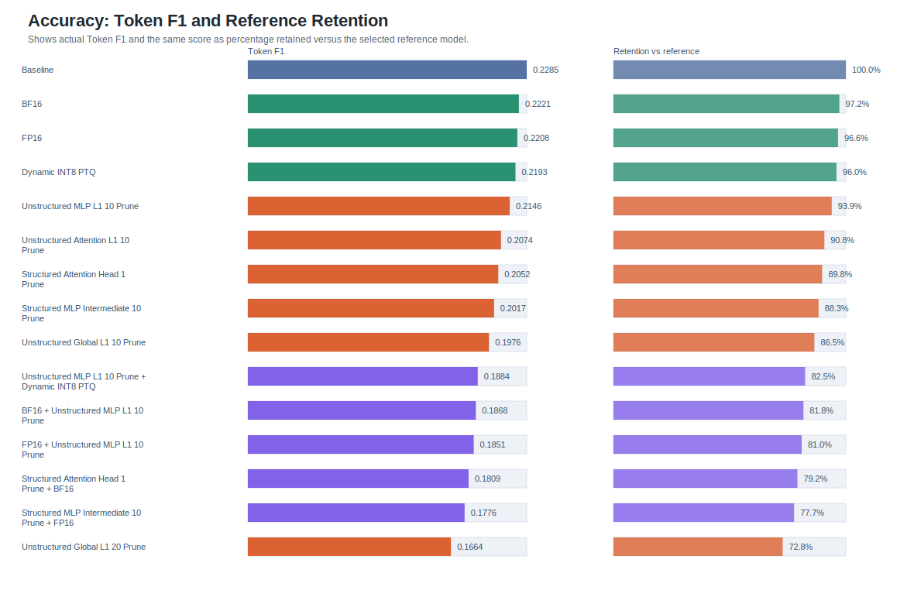
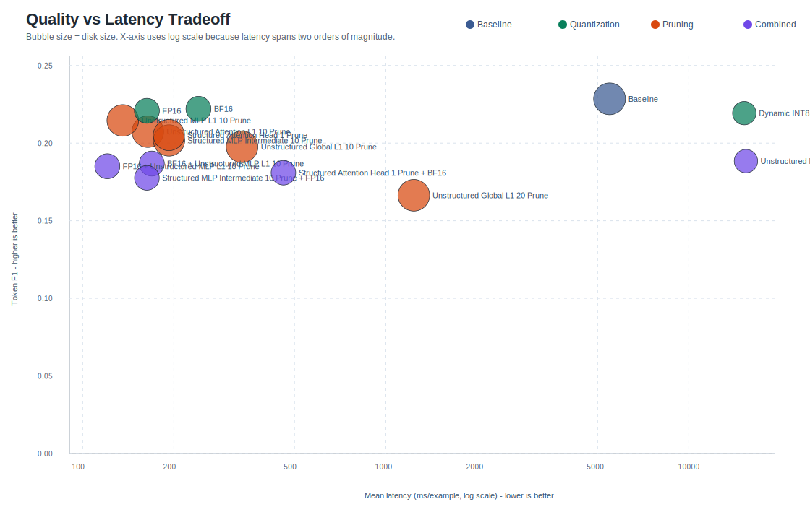
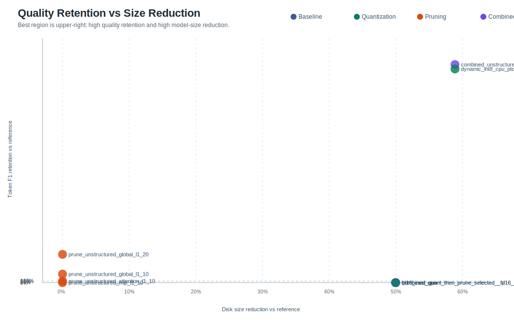
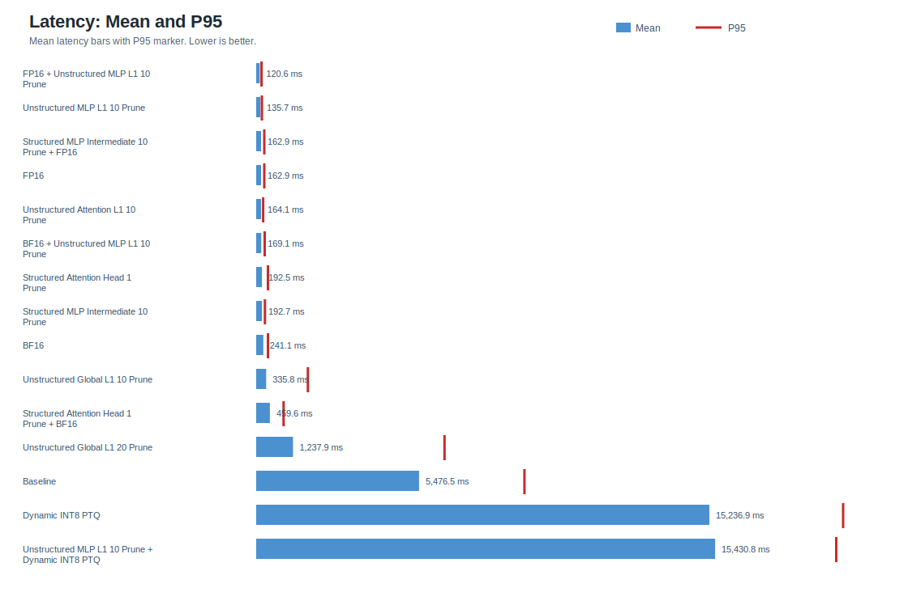
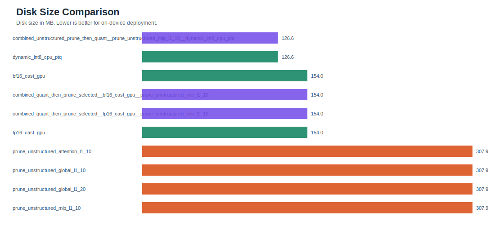
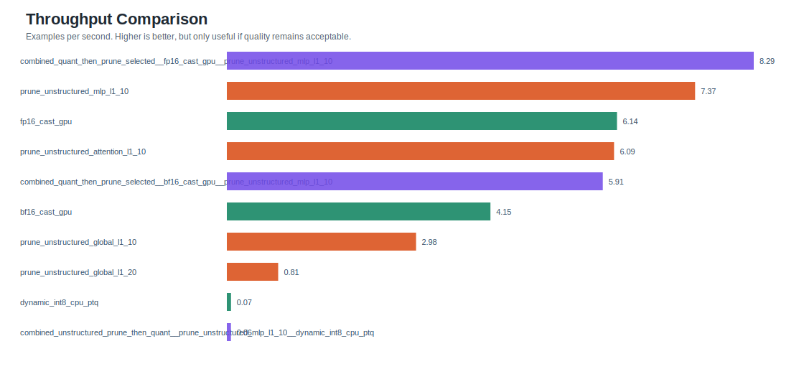
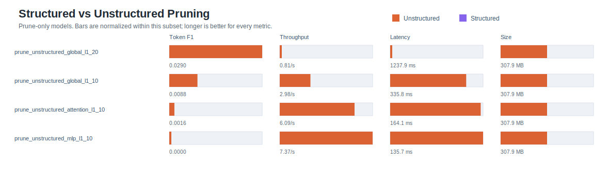
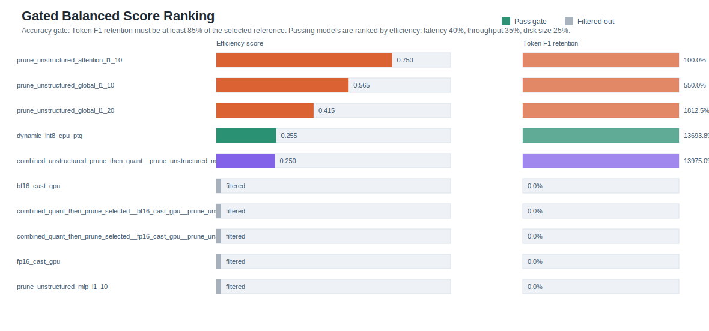

# On-Device-Real-Estate-Assistant

On-Device-Real-Estate-Assistant is an on-device real-estate assistant prototype. The project keeps a domain FLAN-T5 question-answering model, exports it to ONNX for Android inference, and benchmarks multiple optimization strategies on an Android ARM64 environment.

Team: Phong Cao, Trang Tran, Mai Do  
School: Worcester Polytechnic Institute

The current repository is organized as a runnable project, not as a notebook dump. The final benchmark aggregate is [results/all_benchmarks.json](results/all_benchmarks.json), and the generated report plots are in [benchmarks/visualizations/tradeoff_plots](benchmarks/visualizations/tradeoff_plots).

## Project Goals

- Run a real-estate question-answering model locally on a phone which is limited resources.
- Compare model optimization strategies for on-device deployment.
- Measure both answer quality and device efficiency.
- Package the Android inference path with ONNX Runtime.
- Keep the final benchmark result reproducible and easy to inspect.

## Repository Structure

```text
app/android/                         Android app project
models/
  flan_t5_zillow_final1/              Hugging Face FLAN-T5 model assets
  whisper_model/                      Whisper speech model assets
  export_to_onnx.py                   PyTorch/Hugging Face -> ONNX export script
benchmarks/
  data/flan_t5_baseline/              fixed QA pair cache and eval split
  requirements.txt                    Python benchmark dependencies
  visualizations/                     plot generator and final SVG charts
results/
  all_benchmarks.json                 final Android benchmark aggregate
src/
  benchmarking/                       benchmark runner, split builder, metrics
  optimization/                       pruning/quantization strategy code
```

## System Overview

The full project pipeline is:

```text
User input
  -> typed text
  -> voice input -> phone speech-to-text -> text

Text prompt
  -> FLAN-T5 real-estate question-answering model
  -> optional optimization experiments
       -> quantization: FP16, BF16, INT8
       -> pruning: attention, MLP, global unstructured pruning
       -> combined pruning + quantization

Selected / exported model
  -> models/export_to_onnx.py
  -> ONNX encoder and decoder files
  -> app/android/app/src/main/assets/onnx_model/

Android phone
  -> ONNX Runtime Android
  -> local inference
  -> generated answer displayed in the app
```

The Android app does not run PyTorch or TensorFlow directly. It loads the exported `.onnx` encoder and decoder files through ONNX Runtime Android. Because ONNX Runtime expects numeric tensors instead of raw text, the app also bundles the matching FLAN-T5 tokenizer file, `spiece.model`. A small native C++ SentencePiece bridge loads that file, converts user text into the token IDs expected by the ONNX model, and decodes generated token IDs back into readable text.

## Methodology

The benchmark compares optimization families that are common for on-device transformer deployment:

- Quantization: `fp16`, `bf16`, and `int8`
- Pruning: unstructured attention, MLP, and global pruning
- Combined pipelines: pruning plus quantization

Each model is evaluated against the same fixed benchmark split:

- Pair cache: [benchmarks/data/flan_t5_baseline/qa_pairs.jsonl](benchmarks/data/flan_t5_baseline/qa_pairs.jsonl)
- Split manifest: [benchmarks/data/flan_t5_baseline/split_manifest.json](benchmarks/data/flan_t5_baseline/split_manifest.json)
- Source dataset: `zillow/real_estate_v1`
- Eval split: `10%`
- Split seed: `42`

Measured quality metrics:

- Token F1
- ROUGE-L F1
- Exact match
- Eval loss when available

Measured efficiency metrics:

- Disk size
- Parameter count
- Model load time
- RSS memory before/after load
- Mean, P50, and P95 latency
- Examples per second
- Generated tokens per second

## Results

The final retained benchmark file is:

```text
results/all_benchmarks.json
```

### Accuracy And Retention



### Quality vs Latency



### Size Reduction Tradeoff



### Latency



### Disk Size



### Throughput



### Pruning Comparison



### Balanced Ranking



## Result Analysis

The fastest model in the final Android benchmark is:

```text
combined_quant_then_prune_selected__fp16_cast_gpu__prune_unstructured_mlp_l1_10
```

It reaches `120.6 ms` mean latency, `180.8 ms` P95 latency, and `8.29 examples/sec`, but its Token F1 is `0.0000` in the retained benchmark output.

The smallest and highest Token F1 model is:

```text
combined_unstructured_prune_then_quant__prune_unstructured_mlp_l1_10__dynamic_int8_cpu_ptq
```

It has the best Token F1 in the final aggregate at `0.2236` and the smallest disk size at `126.58 MB`, but it is much slower: `15430.8 ms` mean latency and `0.0648 examples/sec`.

The plain dynamic INT8 model is close:

```text
dynamic_int8_cpu_ptq
```

It has Token F1 `0.2191`, the same `126.58 MB` disk size, and similar latency at `15236.9 ms`.

The best practical interpretation is:

- FP16-style paths are much faster in this benchmark, but the retained output shows failed answer quality.
- INT8 paths preserve much more measured Token F1 and reduce size by about `59%`, but latency is too high for a smooth chat experience.
- Unstructured pruning alone does not reduce serialized disk size in this artifact format, so it is not enough by itself for deployment.
- The final result favors INT8 for compression/quality experiments, but the Android inference path needs more runtime optimization before it is production-ready.

Important caveat: several generated retention percentages are inflated because the selected reference model has very low absolute Token F1. Use the absolute Token F1, latency, and disk-size numbers for decision-making.

## Benchmark Summary

| Model | Family | Token F1 | Size MB | Mean ms | P95 ms | Examples/s |
|---|---:|---:|---:|---:|---:|---:|
| `combined_quant_then_prune_selected__fp16_cast_gpu__prune_unstructured_mlp_l1_10` | combined | 0.0000 | 154.01 | 120.6 | 180.8 | 8.2905 |
| `prune_unstructured_mlp_l1_10` | prune | 0.0000 | 307.93 | 135.7 | 190.7 | 7.3673 |
| `fp16_cast_gpu` | quant | 0.0000 | 154.01 | 162.9 | 271.5 | 6.1392 |
| `prune_unstructured_attention_l1_10` | prune | 0.0016 | 307.93 | 164.1 | 235.4 | 6.0929 |
| `combined_quant_then_prune_selected__bf16_cast_gpu__prune_unstructured_mlp_l1_10` | combined | 0.0000 | 154.01 | 169.1 | 287.4 | 5.9147 |
| `bf16_cast_gpu` | quant | 0.0000 | 154.01 | 241.1 | 394.2 | 4.1471 |
| `prune_unstructured_global_l1_10` | prune | 0.0088 | 307.93 | 335.8 | 1739.0 | 2.9779 |
| `prune_unstructured_global_l1_20` | prune | 0.0290 | 307.93 | 1237.9 | 6331.2 | 0.8078 |
| `dynamic_int8_cpu_ptq` | quant | 0.2191 | 126.58 | 15236.9 | 19735.6 | 0.0656 |
| `combined_unstructured_prune_then_quant__prune_unstructured_mlp_l1_10__dynamic_int8_cpu_ptq` | combined | 0.2236 | 126.58 | 15430.8 | 19503.6 | 0.0648 |

## How To Run

### 1. Install Python Benchmark Dependencies

```bash
python3 -m venv .venv
source .venv/bin/activate
pip install -r benchmarks/requirements.txt
```

### 2. Regenerate Benchmark Plots

```bash
python benchmarks/visualizations/generate_tradeoff_plots.py
```

Output:

```text
benchmarks/visualizations/tradeoff_plots/
```

Open the generated HTML report:

```text
benchmarks/visualizations/tradeoff_plots/index.html
```

### 3. Run The FLAN-T5 Benchmark Harness

```bash
python -m src.benchmarking.benchmark_flan_t5 \
  --model-path models/flan_t5_zillow_final1 \
  --split-manifest benchmarks/data/flan_t5_baseline/split_manifest.json \
  --output-dir benchmarks/runs/flan_t5_baseline/results \
  --device auto
```

### 4. Rebuild The Benchmark Split

This downloads/rebuilds the benchmark pair cache from `zillow/real_estate_v1`.

```bash
python -m src.benchmarking.build_flan_t5_split \
  --output-dir benchmarks/data/flan_t5_baseline
```

### 5. Export FLAN-T5 To ONNX For Android

```bash
python models/export_to_onnx.py
```

Output:

```text
app/android/app/src/main/assets/onnx_model/
```

### 6. Build The Android App

```bash
cd app/android
./gradlew assembleDebug
```

The Android app loads:

```text
app/android/app/src/main/assets/onnx_model/encoder_model.onnx
app/android/app/src/main/assets/onnx_model/decoder_model.onnx
app/android/app/src/main/assets/onnx_model/decoder_with_past_model.onnx
```

## Android Runtime

The Android app uses:

```kotlin
implementation("com.microsoft.onnxruntime:onnxruntime-android:1.17.3")
```

At runtime, `MainActivity.kt` copies the `onnx_model` asset folder into app storage, creates ONNX Runtime sessions for the encoder and decoder, tokenizes with SentencePiece, and decodes greedily token by token.

## Current Limitations

- The app currently runs FLAN-T5 ONNX inference, but the retained benchmark results include separate Android/Termux-style PyTorch measurements for optimized artifacts.
- Whisper assets are retained, but the current Android app uses Android speech recognition for microphone input rather than the bundled Whisper models.
- The measured INT8 models preserve better Token F1 but are too slow in the retained benchmark.
- The faster FP16/BF16-style variants need quality debugging before they are useful.
- The benchmark quality scores are low overall, so future work should improve prompt parity, decoding settings, and evaluation data quality.

## Recommended Next Steps

- Align Android decoding settings with the Python benchmark settings.
- Benchmark the exact ONNX Android app path, not only Android/Termux model artifacts.
- Investigate why FP16/BF16 variants produce near-zero retained Token F1.
- Add an end-to-end scripted smoke test for export -> Android asset validation.
- Evaluate ONNX Runtime execution providers and decoder-with-past usage for latency.
- Decide whether Whisper should be integrated directly or removed from the active scope.
